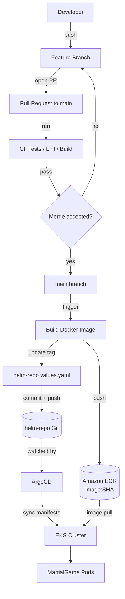

# MartialGame

A containerized application deployed to AWS EKS using a GitOps workflow. This repository contains the application source code, the Dockerfile, and the CI/CD pipeline that builds and ships the image.

Part of a three-repository setup:

| Repo | Purpose |
|------|---------|
| **martialgame** (this repo) | Application source, Dockerfile, CI/CD |
| `martialgame-helm` | Helm chart and environment values (ArgoCD watches this) |
| `martialgame-infra` | Terraform: VPC, EKS, IAM, ECR |

---

## Architecture



---

## How It Works

1. Developer pushes to a feature branch and opens a PR to `main`.
2. CI runs tests, lint, and a build check on the PR.
3. On merge to `main`, the deploy workflow builds a Docker image tagged with the commit SHA and pushes it to Amazon ECR.
4. The workflow updates the image tag in `helm-repo` and pushes the change.
5. ArgoCD detects the change and syncs the cluster.
6. New pods roll out pulling the updated image from ECR.

---

## Running Locally

### Without Docker

Install dependencies and run the app in development mode. The app listens on port `8080` by default.

### With Docker

Build the image locally and run it in a container, mapping the container port to a local port. Open the app in your browser at the mapped address.

---

## Project Structure

```
martialgame/
├── .github/
│   └── workflows/
│       └── deploy.yml      # build + push + helm tag update
├── Dockerfile
├── <source files>
└── README.md
```

---

## CI/CD Pipeline

Defined in `.github/workflows/deploy.yml`.

**Trigger:** push to `main` (i.e. a merged PR)

**Steps:**

1. Check out source
2. Assume IAM role via OIDC
3. Log in to Amazon ECR
4. Build image tagged with the commit SHA
5. Push image to ECR
6. Check out `helm-repo` using a scoped PAT
7. Update the image tag in the environment values file
8. Commit and push to `helm-repo`

**Required secrets:**

| Secret | Purpose |
|--------|---------|
| `HELM_REPO_PAT` | Push access to `helm-repo` |

AWS credentials are not stored — the workflow assumes a role via OIDC.

---

## Image Tagging

Images are tagged with the Git commit SHA. Tags are immutable — one tag per commit. This lets ArgoCD detect changes reliably; a `latest` tag would break GitOps sync.

---

## Deployment

Deployments are handled entirely through Git:

- **Merging to `main`** triggers a build and pushes an updated tag to `helm-repo`.
- **ArgoCD** syncs the cluster to match `helm-repo` automatically.

To roll back, revert the tag commit in `helm-repo`.

---

## Related Repos

- **`helm-repo`** — Helm chart and per-environment values
- **`infra-repo`** — Terraform for AWS infrastructure

---

## Troubleshooting

| Symptom | Cause | Fix |
|---------|-------|-----|
| `ImagePullBackOff` | Node IAM missing ECR read perms | Attach ECR read policy / configure IRSA |
| CI checkout of `helm-repo` fails | PAT expired or missing scope | Regenerate PAT, update `HELM_REPO_PAT` |
| ECR login fails in CI | OIDC role trust misconfigured | Verify OIDC provider and role trust |
| Docker build fails | Missing dependency or base image issue | Check Dockerfile and lockfile |

---

## License

This project is licensed under the MIT License.